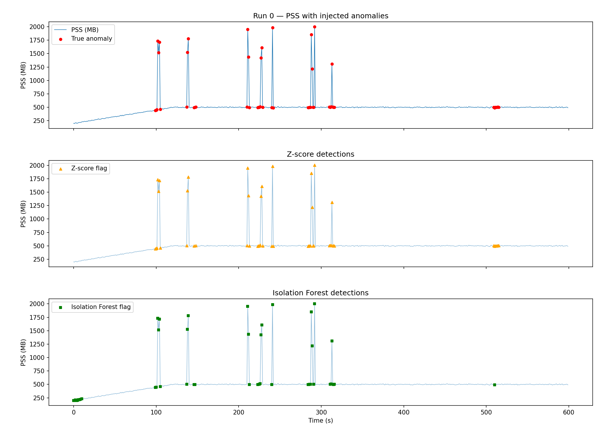
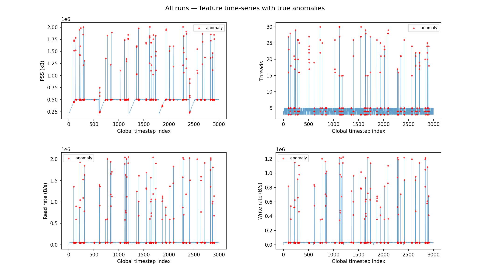
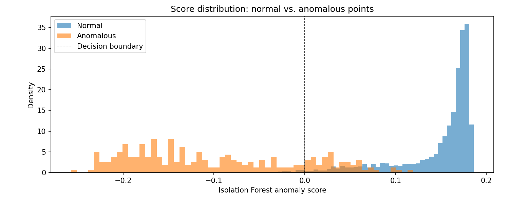
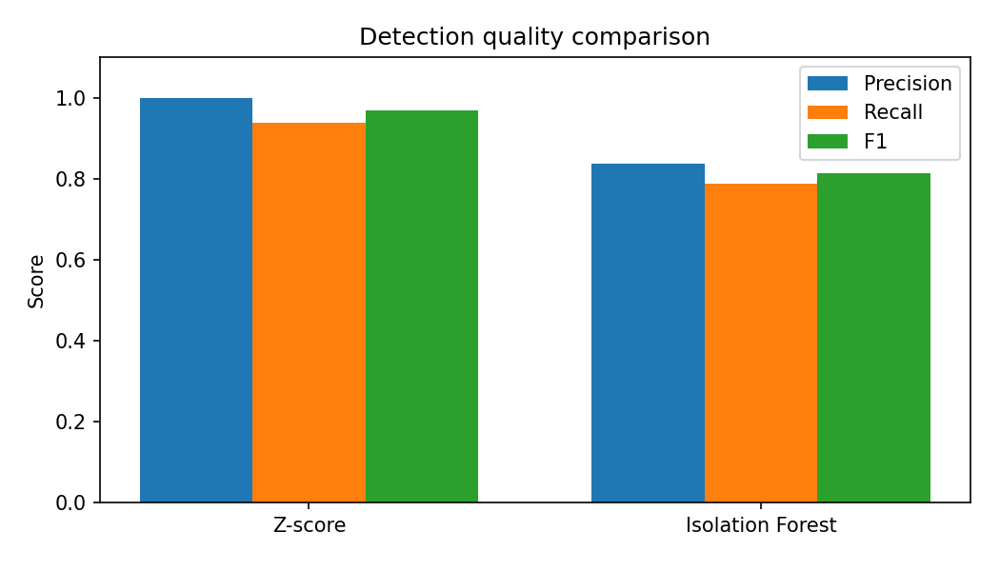

# Process Resource Monitoring & Anomaly Detection with prmon

## Overview

This project explores anomaly detection on process resource time-series data in
the style of [prmon](https://github.com/HSF/prmon), the CERN HSF process
monitor. prmon tracks CPU, memory, I/O, and thread metrics of running processes
at regular intervals, producing tab-separated time-series files.

**AI disclosure:** GitHub Copilot (Claude Opus 4.6) was used as an assistant for
code generation, pipeline design, and report drafting. All design decisions and
results interpretation were reviewed by the author.

---

## 1. About prmon

prmon is a C++/Linux utility that wraps a target process and periodically
samples:

| Metric | Description |
|--------|-------------|
| `wtime` | Wall-clock time (s) |
| `utime` / `stime` | User / system CPU time |
| `rss` / `pss` | Resident / proportional set size (kB) |
| `vmem` | Virtual memory (kB) |
| `rchar` / `wchar` | Cumulative bytes read / written |
| `nthreads` / `nprocs` | Thread and process counts |

It includes built-in **burner tests** (`--burn-memory`, `--burn-io`) that
allocate controlled workloads for benchmarking.  Because prmon is Linux-only,
this project **faithfully replicates its output schema** using a Python
simulator, producing equivalent CSV files with realistic patterns.

---

## 2. Data Generation

### Normal runs

Each simulated run (600 timesteps at 1 s intervals) models a memory-burner
workload:

- **PSS/RSS**: ramp from ~200 MB to ~500 MB over 2 minutes, then plateau with
  Gaussian noise (~5 MB σ).
- **I/O counters**: steady cumulative growth (~50 kB/s read, ~30 kB/s write).
- **Threads**: stable at 4 ± 1.

Five independent runs produce a 3 000-row dataset.

### Anomaly injection (~8.5 % of points)

Three anomaly types are injected at random positions in contiguous bursts
(3–8 timesteps), simulating prmon burner tests with modified parameters:

| Type | What changes | Magnitude |
|------|-------------|-----------|
| **Memory spike** | PSS and RSS multiplied by 2–4× | Mimics `--burn-memory` with elevated allocation |
| **I/O burst** | Cumulative read/write counters jump by 0.5–2 MB | Mimics `--burn-io` with large block sizes |
| **Thread surge** | `nthreads` jumps to 15–30 | Mimics spawning extra worker threads/processes |

```python
# Example: memory spike injection
factor = rng.uniform(2.0, 4.0)
df.loc[idx, "pss"] = int(df.loc[idx, "pss"] * factor)
df.loc[idx, "rss"] = int(df.loc[idx, "rss"] * factor)
```

---

## 3. Feature Engineering

From the raw prmon columns we derive five detection features:

| Feature | Source | Rationale |
|---------|--------|-----------|
| `pss` | Direct | Catches memory anomalies |
| `rss` | Direct | Correlated with PSS; reinforces memory signal |
| `nthreads` | Direct | Catches thread surges |
| `d_rchar` | diff(`rchar`) per run | I/O read rate; catches burst reads |
| `d_wchar` | diff(`wchar`) per run | I/O write rate; catches burst writes |

---

## 4. Anomaly Detection Methods

### 4a. Z-score (statistical baseline)

For each feature, compute the mean and standard deviation over the full dataset.
Flag any point where **any** feature has |z| > 2.5.

```python
z = ((features - means) / stds).abs()
anomaly = (z.max(axis=1) > 2.5)
```

### 4b. Isolation Forest (unsupervised ML)

Isolation Forest isolates anomalies by randomly partitioning features. Points
that require fewer splits to isolate receive lower anomaly scores.

```python
iso = IsolationForest(n_estimators=200, contamination=0.08, random_state=42)
iso.fit(features)
predictions = iso.predict(features)  # -1 = anomaly
```

---

## 5. Results

### Detection quality

| Method | Precision | Recall | F1 |
|--------|-----------|--------|----|
| Z-score (|z| > 2.5) | **1.000** | 0.937 | **0.968** |
| Isolation Forest | 0.838 | 0.788 | 0.812 |

### Confusion matrices

**Z-score:**
```
             Predicted Normal   Predicted Anomaly
Actual Normal       2745               0
Actual Anomaly        16             239
```

**Isolation Forest:**
```
             Predicted Normal   Predicted Anomaly
Actual Normal       2706              39
Actual Anomaly        54             201
```

### Plots

#### PSS time-series with anomaly flags (Run 0)


Three panels show the same run's PSS trace with: (top) true injected anomalies,
(middle) Z-score detections, (bottom) Isolation Forest detections.

#### Multi-metric overview (all runs)


PSS, thread count, and I/O rates across all 3 000 timesteps, with true anomalies
in red.

#### Isolation Forest score distribution


Anomalous points cluster toward lower (more negative) scores, but overlap with
normal points explains the lower precision.

#### Detection comparison


---

## 6. Discussion

### Why Z-score outperformed Isolation Forest here

The injected anomalies are **large, unambiguous deviations** (2–4× memory,
15–30 threads vs. a baseline of 4). Z-score's per-feature threshold catches
these cleanly because:

1. **Anomalies are univariate outliers.** Each anomaly type affects a single
   feature dramatically. Z-score checks each feature independently, which is
   optimal for this signal structure.
2. **Normal data is approximately Gaussian.** The simulation uses Gaussian noise
   around smooth trends, which is Z-score's ideal regime.
3. **No complex interactions to model.** Isolation Forest's strength is
   detecting multi-dimensional clusters of unusual behaviour—unnecessary here.

### When Isolation Forest would be preferred

- **Subtle anomalies**: if anomalous burner tests only elevated PSS by 20 %
  instead of 200 %, Z-score's fixed threshold would miss them while Isolation
  Forest could still characterise the distributional shift.
- **Multivariate correlations**: real production workloads may show anomalies
  that are only visible in the *joint* distribution (e.g. high memory + low CPU
  = memory leak; high I/O + high threads = fork bomb). Isolation Forest captures
  these naturally.
- **Non-stationary baselines**: real prmon data has trends, ramps, and phase
  transitions. Global Z-score breaks down; a sliding-window variant or
  model-based approach (Isolation Forest, autoencoders) adapts better.

### Trade-offs

| Aspect | Z-score | Isolation Forest |
|--------|---------|------------------|
| Interpretability | High — threshold on each feature | Moderate — score, but not per-feature |
| Speed | O(n·d) — trivial | O(n·d·T) — T trees, still fast |
| Tuning | Threshold only | n_estimators, contamination, max_features |
| Robustness to non-Gaussian data | Low | High |
| Multi-dimensional anomalies | Misses correlated shifts | Captures them |

### Limitations

- This is synthetic data; real prmon traces have autocorrelation, seasonal
  patterns, and non-stationarity not fully modelled here.
- Both methods operate point-wise; sequence-aware methods (LSTM autoencoders,
  change-point detection) could exploit temporal structure.
- The contamination parameter for Isolation Forest was set to the true anomaly
  rate — in practice this is unknown and must be estimated.

---

## Repository structure

```
prmon_anomaly_detection.py   — Full pipeline: data generation → detection → plots
prmon_output/
  prmon_run_000.csv … 004    — Simulated prmon output (tab-separated)
  combined_labelled.csv      — All runs with ground-truth anomaly labels
plots/
  pss_anomalies_run0.png     — PSS time-series with detection overlays
  multi_metric_overview.png  — All features, all runs
  isoforest_score_distribution.png
  detection_comparison.png   — Precision / Recall / F1 bar chart
README.md                    — This report
```

## How to reproduce

```bash
python prmon_anomaly_detection.py
```

Requires: Python ≥ 3.10, numpy, pandas, matplotlib ≥ 3.10, scikit-learn.
